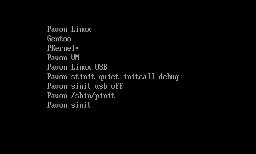

pboot is an ultra minimalistic EFI Linux bootloader developed with the suckless philosophy

100% functional in real environments.

You can load Linux kernels with parameters.

It's configure with config.h file and configuration take effects after compilation
like suckless's projects

How to use:
If the configuration "show_menu" is "true" in config.h the bootloader will show
the menu infinitlly unless you press the rigth arrow key -> to boot the entry
You can navigate with the arrow keys up and down.

If the configuration "show_menu" is "false" in config.h the bootloader
will boot the "default_entry" defined with a "int" number in config.h
You can press the left arrow key <- after press the computer power button
to show the menu if you want to choose an entry

This bootloader doesn't need any more feature
Do one thing and do it well
